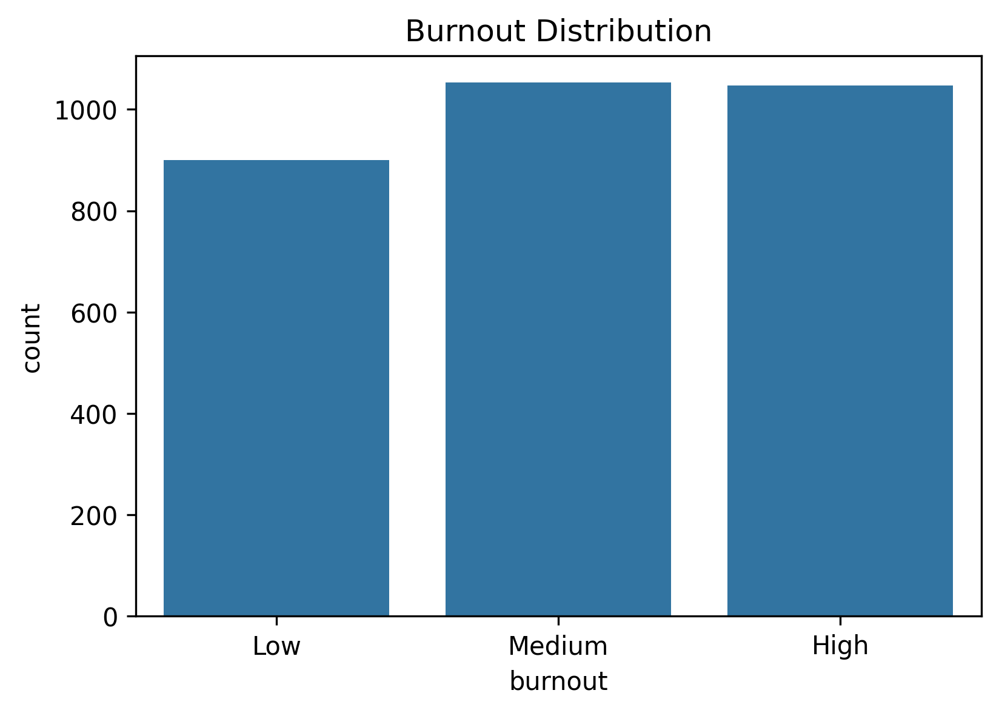
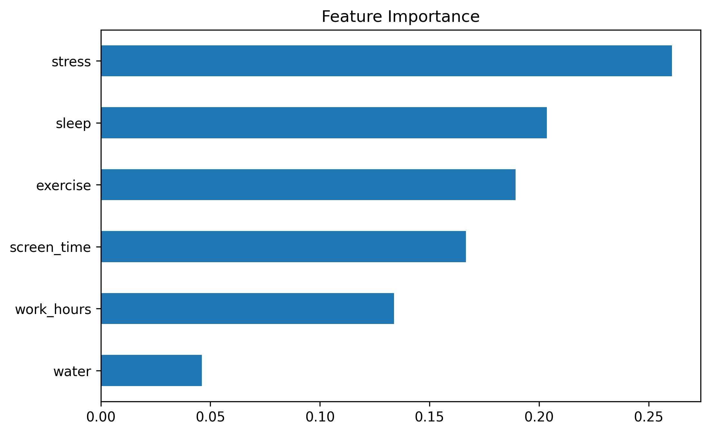
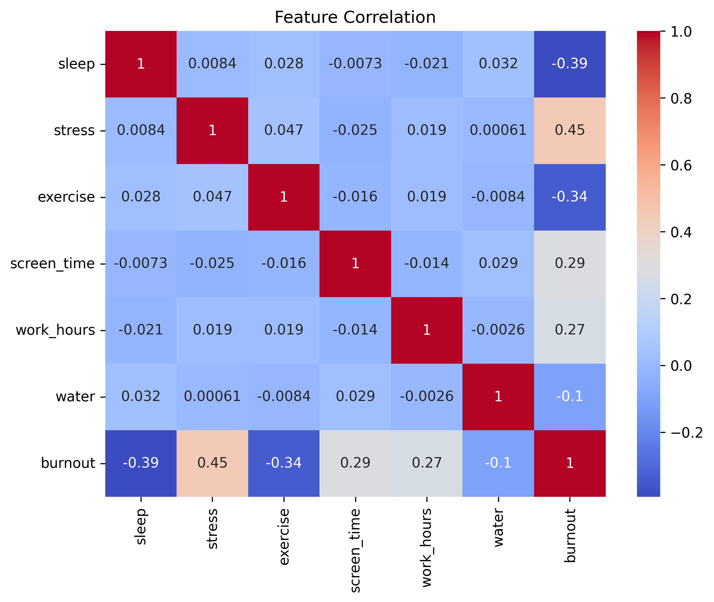
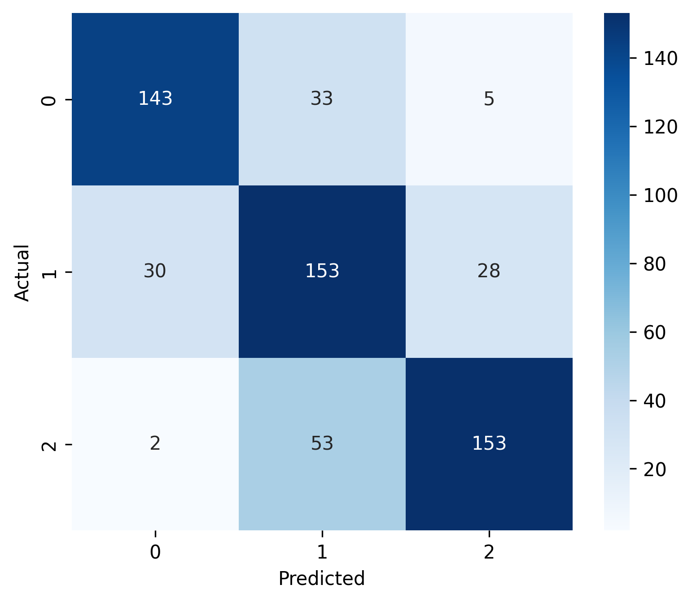

# 🧠 MindPulse AI


## 🚀 Machine Learning-Based Burnout Risk Prediction & Wellness Recommendation System

MindPulse AI is a machine learning project that predicts an individual's burnout risk using lifestyle and work-related factors such as sleep, stress, exercise, screen time, work hours, and water intake.

The system classifies users into:

- 🟢 Low Burnout Risk
- 🟡 Medium Burnout Risk
- 🔴 High Burnout Risk

and provides personalized wellness recommendations based on the predicted risk level.

> **Note:** This project uses synthetically generated data and is intended for educational and research purposes only.

---

# 🌟 Why MindPulse AI?

Burnout has become increasingly common among students and working professionals due to prolonged stress, unhealthy routines, and excessive workloads.

MindPulse AI demonstrates how Machine Learning can be leveraged to identify burnout patterns early and encourage healthier lifestyle choices through data-driven insights.

---

# ✨ Features

- 🧠 Burnout Risk Prediction
- 🤖 Random Forest Classification
- 📊 Feature Importance Analysis
- 📈 Correlation Heatmap
- 📉 Confusion Matrix Visualization
- 🔄 5-Fold Cross Validation
- 💡 Personalized Wellness Recommendations
- 🎯 Confidence-Based Predictions
- 📝 Synthetic Dataset Generation

---

# 🏗️ Project Workflow

```text
Lifestyle Data
      │
      ▼
Synthetic Dataset Generation
      │
      ▼
Data Preprocessing
      │
      ▼
Random Forest Training
      │
      ▼
Model Evaluation
      │
      ▼
Burnout Prediction
      │
      ▼
Wellness Recommendations
```

---

# 📋 Input Features

The model predicts burnout risk using the following parameters:

| Feature | Description |
|----------|-------------|
| 😴 Sleep Hours | Average daily sleep duration |
| 😰 Stress Level | Self-reported stress score |
| 🏃 Exercise Days | Weekly exercise frequency |
| 💻 Screen Time | Daily screen exposure |
| 🧑‍💻 Work Hours | Average daily work duration |
| 💧 Water Intake | Daily hydration level |

---

# 🧠 Machine Learning Model

The project uses a **Random Forest Classifier** trained on synthetically generated data.

To improve robustness:

- Random noise was introduced during data generation.
- Model complexity was controlled using tree depth and minimum sample constraints.
- Performance was validated using **5-Fold Cross Validation**.

---

# 📊 Model Performance

| Metric | Value |
|----------|---------|
| Test Accuracy | **~91%** |
| Cross Validation Accuracy | **~88.6%** |
| Model | Random Forest Classifier |
| Prediction Classes | Low • Medium • High |

The relatively small gap between training and testing accuracy indicates good generalization while reducing overfitting.

---

# 📷 Project Visualizations

## 📈 Burnout Distribution



---

## 🔥 Feature Importance



---

## 📊 Correlation Heatmap



---

## ✅ Confusion Matrix



---

# 🎯 Sample Prediction

```text
Input

Sleep Hours      : 5
Stress Level     : 9
Exercise Days    : 1
Screen Time      : 10
Work Hours       : 11
Water Intake     : 2

↓

Prediction

🔴 Burnout Risk : High

Confidence      : 91.4%

Recommendations

• Improve sleep schedule
• Reduce screen exposure
• Exercise regularly
• Stay hydrated
• Take periodic work breaks
```

---

# 📂 Project Structure

```
MindPulse-AI/
│
├── MindPulse_AI_Burnout_Prediction.ipynb
├── README.md
├── requirements.txt
└── images/
    ├── burnout_distribution.png
    ├── confusion_matrix.png
    ├── correlation_heatmap.png
    └── feature_importance.png
```

---

# 🛠️ Installation

Clone the repository:

```bash
git clone https://github.com/YOUR_GITHUB_USERNAME/MindPulse-AI.git
```

Move into the project:

```bash
cd MindPulse-AI
```

Install dependencies:

```bash
pip install -r requirements.txt
```

Run the notebook using **Google Colab** or **Jupyter Notebook**.

---

# 🔬 Future Improvements

- 🌐 Streamlit Web Application
- 📄 PDF Report Generation
- 🧠 SHAP Explainability
- 🤖 Deep Learning Models
- ☁️ Cloud Deployment
- 📊 Real-world Survey Dataset
- 📱 Mobile Application
- 🔐 User Authentication

---

# ⚠️ Limitations

- The dataset is synthetically generated for demonstration purposes.
- The model should not be interpreted as a medical or psychological diagnostic tool.
- Real-world deployment would require validated datasets and expert evaluation.

---

# 🛠️ Technologies Used

- Python
- Pandas
- NumPy
- Scikit-learn
- Matplotlib
- Seaborn
- Joblib

---

# 👨‍💻 Author

**Parth Mandore**

Built with ❤️ using Python, Machine Learning, and Data Science.

If you found this project interesting, consider giving it a ⭐ on GitHub!
